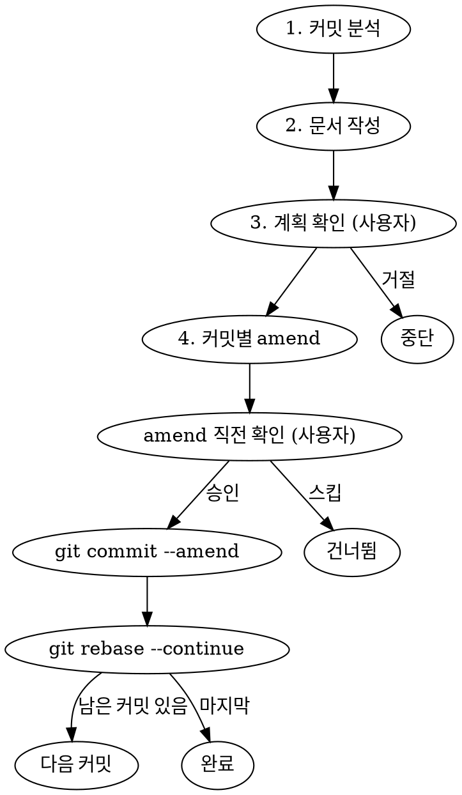

# Doc Amend

커밋이 나뉘어진 작업 이후, 각 커밋에 부족한 문서 파일(테스트, README, stories, markdown 등)을 보강하고 해당 커밋에 amend하는 작업을 안내합니다.

## 문서 파일이란

런타임/컴파일에서는 검증되지 않는 메타파일들:

| 종류 | 패턴 |
| ---- | ---- |
| 테스트 | `__tests__/*.test.ts` |
| README | `README.md` |
| Stories | `*.stories.ts` |
| Markdown | `*.md` (CHANGELOG, MIGRATION 등) |

## 4단계 워크플로우



---

## Phase 1: 커밋 분석

분석 범위를 결정한다. 기본은 현재 브랜치에서 main 대비 커밋들.

```bash
# 작업 범위 파악
git log --oneline main..HEAD

# 각 커밋에서 변경된 파일 확인
git show --stat <hash>
```

각 커밋에 대해 다음을 판단:

1. **변경된 소스 파일**이 있는가? (`.vue`, `.ts` — 단, 문서 제외)
2. 그 변경에 **대응하는 문서 파일**이 해당 커밋에 포함되었는가?
3. 포함되지 않았다면 어떤 문서가 **누락**되었는가?

### 누락 판단 기준

| 소스 변경 | 확인할 문서 |
| --------- | ----------- |
| 컴포넌트 props/events/slots 추가·변경·제거 | `README.md` Props·Events·Slots 테이블 |
| 컴포넌트 StyleSet 변경 | `README.md` Types 섹션 |
| 새 동작/버그 수정 | `__tests__/*.test.ts` |
| 새 컴포넌트 추가 | `README.md` 전체, `__tests__/`, `*.stories.ts` |
| 컴포넌트 제거 | 관련 문서 파일 삭제 여부 |

---

## Phase 2: 문서 작성

**모든 문서를 미리 작성한다.** rebase 도중에 파일을 생성하지 않는다.

- 파일을 작성하되, `git add` 하지 않는다 (working tree에만 존재)
- 어느 커밋에 속할지 메모해둔다

### 문서 품질 기준

**README.md**
- component-review skill의 Documentation 섹션 체크리스트를 따른다
- 영어로 작성
- Props/Events/Slots/Methods 테이블 — `Version` 컬럼 포함
- Types 섹션에 현재 StyleSet 구조 반영

**테스트 (`__tests__/*.test.ts`)**
- `given / when / then` 구조 사용
- 동작을 검증하는 테스트, DOM 구조만 확인하는 테스트는 지양
- 각 prop의 happy path, 이벤트 발생 여부 포함

**Stories (`*.stories.ts`)**
- 변경된 props/slots을 반영한 예시 추가

---

## Phase 3: 계획 확인

모든 문서 작성이 끝난 후, **rebase 시작 전에** 사용자에게 전체 계획을 제시하고 승인을 받는다.

```
📋 Doc Amend 계획

커밋 1: abc1234 "feat(VsButton): add loading prop"
  → 보강할 파일:
    - packages/vlossom/src/components/vs-button/README.md (Props 테이블 업데이트)
    - packages/vlossom/src/components/vs-button/__tests__/vs-button.test.ts (loading 테스트 추가)

커밋 2: def5678 "fix(VsInput): fix height style"
  → 보강할 파일:
    - packages/vlossom/src/components/vs-input/README.md (StyleSet Types 수정)

위 계획대로 interactive rebase를 진행할까요?
```

**사용자가 거절하면 중단.** 파일은 working tree에 남아있으므로 수동으로 처리 가능.

---

## Phase 4: 커밋별 Amend

### rebase 시작

`GIT_SEQUENCE_EDITOR`를 사용해 모든 대상 커밋을 `edit`으로 자동 설정:

```bash
# 대상 커밋 수를 N이라 할 때 (예: 3개)
GIT_SEQUENCE_EDITOR="sed -i 's/^pick/edit/'" git rebase -i HEAD~N
```

> `sed -i` 가 macOS에서 동작 안 할 경우 `sed -i ''` 사용

### 각 커밋에서 반복

rebase가 커밋마다 멈출 때:

1. **현재 커밋 확인**
   ```bash
   git log --oneline -1
   ```

2. **해당 커밋에 속하는 파일을 stage**
   ```bash
   git add <파일1> <파일2>
   git diff --cached --stat
   ```

3. **amend 직전 사용자에게 확인 요청**

   ```
   ✏️  Amend 확인

   커밋: abc1234 "feat(VsButton): add loading prop"
   추가할 파일:
     - packages/vlossom/src/components/vs-button/README.md
     - packages/vlossom/src/components/vs-button/__tests__/vs-button.test.ts

   이 파일들을 위 커밋에 amend하시겠습니까? [y/s/q]
   y = 승인 (amend 실행)
   s = 이 커밋 건너뜀 (파일은 unstage됨)
   q = 전체 중단 (rebase --abort)
   ```

4. **사용자 응답에 따라 처리**

   - `y` (승인):
     ```bash
     git commit --amend --no-edit
     git rebase --continue
     ```
   - `s` (스킵):
     ```bash
     git restore --staged <파일들>
     git rebase --continue
     ```
   - `q` (중단):
     ```bash
     git rebase --abort
     ```
     > working tree의 파일들은 그대로 남음

### rebase 완료 후

```bash
git log --oneline main..HEAD
```

각 커밋에 문서 파일이 올바르게 포함되었는지 확인:

```bash
# 특정 커밋에 포함된 파일 목록 확인
git show --stat <hash>
```

---

## 주의사항

- **Phase 2(문서 작성)를 반드시 Phase 4(rebase) 이전에 완료**한다. rebase 도중 파일을 생성하면 충돌 위험이 있다.
- **`git rebase --continue`는 Claude가 직접 실행**하지 않는다. 사용자가 amend를 승인한 경우에만 실행한다.
- 이미 push된 브랜치에서 rebase를 실행하면 force push가 필요하다. 사용자에게 사전에 알린다.
- 문서 외 소스 파일(`.vue`, `.ts` 등)은 이 skill의 대상이 아니다.

---

## 사용 방법

```
/doc-amend
```

범위를 지정하려면:

```
/doc-amend HEAD~5    # 최근 5개 커밋 검토
/doc-amend abc1234   # 특정 커밋부터 HEAD까지 검토
```
