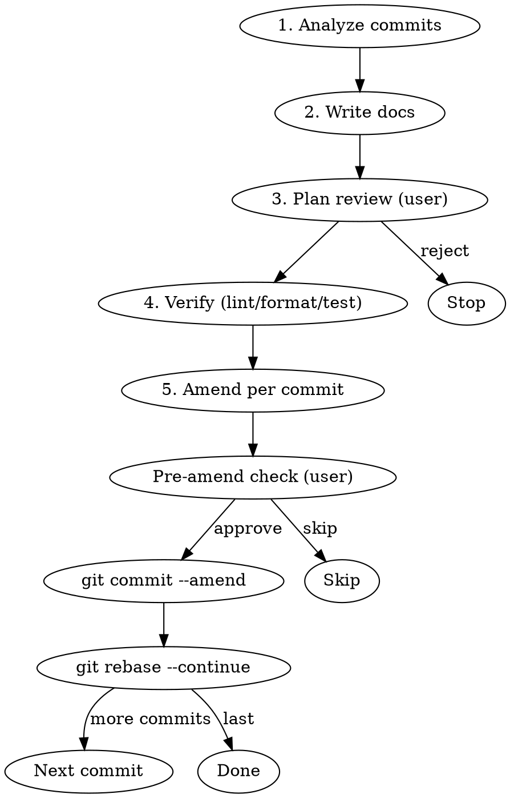

# Doc Amend

After work split across commits, this skill guides you through adding missing documentation files (tests, README, stories, markdown, etc.) and amending them into the correct commits.

## What counts as documentation

Metafiles that are not validated at runtime or compile time:

| Kind             | Pattern                             |
| ---------------- | ----------------------------------- |
| Tests            | `__tests__/*.test.ts`               |
| README (English) | `README.md`                         |
| README (Korean)  | `README.ko.md`                      |
| Stories          | `*.stories.ts`                      |
| Markdown         | `*.md` (CHANGELOG, MIGRATION, etc.) |

## 5-phase workflow



---

## Phase 1: Analyze commits

Define the analysis scope. Default: commits on the current branch compared to `main`.

```bash
# Scope of work
git log --oneline main..HEAD

# Files changed in each commit
git show --stat <hash>
```

For each commit, decide:

1. Are there **changed source files**? (`.vue`, `.ts` — excluding docs)
2. Are the **matching documentation files** included in that commit?
3. If not, which docs are **missing**?

### How to tell what is missing

| Source change                                                        | Documentation to verify                                                                |
| -------------------------------------------------------------------- | -------------------------------------------------------------------------------------- |
| Add/change/remove component/directive props, bindings, events, slots | Relevant tables in `README.md` + keep `README.ko.md` in sync                           |
| Component StyleSet change                                            | `README.md` Types section + `README.ko.md` in sync                                     |
| New behavior or bugfix                                               | `__tests__/*.test.ts`                                                                  |
| New component or directive                                           | Full `README.md` (English), full `README.ko.md` (Korean), `__tests__/`, `*.stories.ts` |
| Component or directive removal                                       | Whether related docs are removed (`README.md` and `README.ko.md` both)                 |

---

## Phase 2: Write documentation

**Write all documentation before rebasing.** Do not create files during the rebase.

- Write files but do **not** `git add` them yet (they exist only in the working tree)
- Note which commit each file belongs to

### Quality bar

**README.md + README.ko.md (bilingual layout)**

- This project uses bilingual READMEs:
    - `README.md` — English (canonical)
    - `README.ko.md` — Korean (translation)
- When adding a component/directive or editing README, **update both files**

### Cross-links on the first line of each file

`README.md` (English):

```
> 한국어: [README.ko.md](./README.ko.md)
```

`README.ko.md` (Korean):

```
> English: [README.md](./README.md)
```

### README.md section order (fixed)

```
# Vs[ComponentName]
[English description]

**Available Version**: X.Y.Z+

## Basic Usage
[code examples — Korean strings translated to English]

## Props
| Prop | Type | Default | Required | Description |

## Types
[StyleSet interface + StyleSet example]

## Events
| Event | Payload | Description |

## Slots
| Slot | Description |

## Methods
| Method | Parameters | Description |

## Features
- **Feature name**: description (translated from Korean)
```

- If there are no Props/Events/Slots/Methods, keep only the table headers
- Reflect the current StyleSet in the Types section
- Follow the Documentation checklist in the component-review skill

**Tests (`__tests__/*.test.ts`)**

- Use a `given / when / then` structure
- Prefer tests that assert behavior; avoid tests that only assert DOM structure
- Cover each prop’s happy path and whether events fire

**Stories (`*.stories.ts`)**

- Add examples that reflect changed props/slots

---

## Phase 3: Plan review

After all docs are written, present the full plan to the user and get approval. **After approval, run Phase 4 (verify), then Phase 5 (interactive rebase)—never skip verification before amending.**

```
📋 Doc Amend plan

Commit 1: abc1234 "feat(VsButton): add loading prop"
  → Files to add:
    - packages/vlossom/src/components/vs-button/README.md (update Props table)
    - packages/vlossom/src/components/vs-button/__tests__/vs-button.test.ts (add loading tests)

Commit 2: def5678 "fix(VsInput): fix height style"
  → Files to add:
    - packages/vlossom/src/components/vs-input/README.md (fix StyleSet Types)

Proceed with interactive rebase as planned?
```

**If the user rejects, stop.** Files remain in the working tree for manual handling.

---

## Phase 4: Verify (pnpm lint / format / test)

After the user approves the plan in Phase 3, **run verification before starting the interactive rebase (Phase 5).** That way lint, format, and tests pass while files are still only in the working tree—fixes do not require rewriting history again.

```bash
# 1. Format — aligns, fixes code style
cd packages/vlossom
pnpm prettier

# 2. Lint — catches code issues
pnpm lint

# 3. Test — confirms nothing is broken
pnpm test
```

Report results to the user. If any command fails:

- **Format errors**: fix style, re-run prettier until clean
- **Lint errors**: fix in the working tree before Phase 5
- **Test failures**: fix root cause before Phase 5

Do not start Phase 5 until all three pass (unless the user explicitly chooses to proceed anyway).

---

## Phase 5: Amend per commit

### Start the rebase

Use `GIT_SEQUENCE_EDITOR` to mark every target commit as `edit`:

```bash
# When there are N target commits (e.g. 3)
GIT_SEQUENCE_EDITOR="sed -i 's/^pick/edit/'" git rebase -i HEAD~N
```

> On macOS, if `sed -i` fails, use `sed -i ''`

### Repeat at each commit

When the rebase stops on each commit:

1. **Confirm the current commit**

    ```bash
    git log --oneline -1
    ```

2. **Stage files that belong to this commit**

    ```bash
    git add <file1> <file2>
    git diff --cached --stat
    ```

3. **Ask the user for confirmation before amending**

    ```
    ✏️  Amend confirmation

    Commit: abc1234 "feat(VsButton): add loading prop"
    Files to add:
      - packages/vlossom/src/components/vs-button/README.md
      - packages/vlossom/src/components/vs-button/__tests__/vs-button.test.ts

    Amend these files into the commit above? [y/s/q]
    y = approve (run amend)
    s = skip this commit (files unstaged)
    q = abort entire rebase (rebase --abort)
    ```

4. **Handle the response**
    - `y` (approve):
        ```bash
        git commit --amend --no-edit
        git rebase --continue
        ```
    - `s` (skip):
        ```bash
        git restore --staged <files>
        git rebase --continue
        ```
    - `q` (abort):
        ```bash
        git rebase --abort
        ```
        > Working tree files are left as-is

### After the rebase finishes

```bash
git log --oneline main..HEAD
```

Verify each commit includes the right documentation:

```bash
# List files in a specific commit
git show --stat <hash>
```

Optionally re-run the Phase 4 commands after the rebase if anything changed on disk (e.g. prettier during amend) or before push as a final safety check.

---

## Caveats

- **Finish Phase 2 (write docs) before Phase 5 (rebase).** Creating files mid-rebase risks conflicts.
- **Run Phase 4 (verify) before Phase 5 (rebase).** Catch lint/format/test failures while changes are still unstaged or easy to fix without another history rewrite.
- **Do not run `git rebase --continue` on your own.** Run it only after the user approves the amend.
- Rebasing a branch that was already pushed requires a force push; warn the user first.
- Non-doc source files (`.vue`, `.ts`, etc.) are out of scope for this skill.
- Before push, ensure Phase 4 has passed; re-run it after the rebase if needed.

---

## How to invoke

```
/doc-amend
```

To limit the range:

```
/doc-amend HEAD~5    # Review the last 5 commits
/doc-amend abc1234   # Review from a specific commit through HEAD
```
